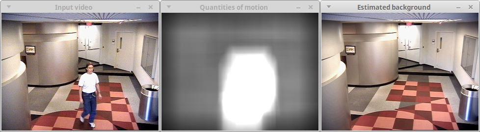

# LaBGen-P


LaBGen-P is a pixel-level stationary background generation method introduced in [[1](#references)], and based on [LaBGen](https://github.com/benlaug/labgen). Note that LaBGen-P has been ranked second during the [IEEE Scene Background Modeling Contest (SBMC) 2016](http://pione.dinf.usherbrooke.ca/sbmc2016).

The purpose of this repository is twofold:

1. To share the source code of the method.
2. To embed the method in a ready-to-use program.

## Performance of the method

Our method won an award and has been ranked second during the [IEEE Scene Background Modeling Contest (SBMC) 2016](http://pione.dinf.usherbrooke.ca/sbmc2016). The current ranking and the quantitative metrics computed on the [SBMnet dataset](http://www.scenebackgroundmodeling.net) are available [here](http://pione.dinf.usherbrooke.ca/results).


## Compiling the program

The program implementing the method has been developed in C++11 and is distributed under the [GPLv3](LICENSE) license. In order to compile it, you need a modern C++ compiler, a copy of the [Boost](http://www.boost.org) library, a copy of the [OpenCV](http://opencv.org) library, and the [CMake](https://cmake.org) build automation tool. On UNIX-like environments, the program can be compiled as follows, considering that your terminal is in the source code directory:

```
$ cd build
$ cmake -DCMAKE_BUILD_TYPE=Release ..
$ make
```

## Running the program

Once the program has been compiled, the following command gives the complete list of available options:

```
$ ./LaBGen-P-cli -h
```

In this program, the syntax used to provide the path of the input video sequence is the same one used by the OpenCV library. Thus, for instance, one can generate a stationary background image for the IBMtest2 sequence of the [SBI dataset](http://sbmi2015.na.icar.cnr.it/SBIdataset.html) [[2](#references)] with *(S, N) = (5, 3)* as follows:

```
$ ./LaBGen-P-cli -i path_to_IBMtest2/IBMtest2_%6d.png -o my_output_path -s 5 -n 3
```

One can directly use the default set of parameters with the `-d` option:

```
$ ./LaBGen-P-cli -i path_to_IBMtest2/IBMtest2_%6d.png -o my_output_path -d
```

Finally, one can observe the processing performed by LaBGen-P in graphical windows by adding the `-v` option:

```
$ ./LaBGen-P-cli -i path_to_IBMtest2/IBMtest2_%6d.png -o my_output_path -d -v
```

With this last option, the processing will be slower has an estimation of the stationary background is generated after each frame in the corresponding window. Here is an example of the execution of the program with the `-v` option:



Note that the program has been successfully tested on Debian-like GNU/Linux operating systems (compiled with `g++`) and macOS (compiled with `clang++`).

## Citation

If you use LaBGen-P in your work, please cite paper [[1](#references)] as below:

```
@inproceedings{Laugraud2016LaBGen-P,
  title = {{LaBGen-P}: A Pixel-Level Stationary Background Generation Method Based on {LaBGen}},
  author = {B. Laugraud and S. Pi{\'e}rard and M. {Van Droogenbroeck}},
  booktitle = {IEEE International Conference on Pattern Recognition (ICPR), IEEE Scene Background Modeling Contest (SBMC)},
  year = {2016},
  address = {Cancun, Mexico}
}
```

## Alternatives

A patch-based variant of LaBGen-P, called LaBGen, is also [available on GitHub](https://github.com/benlaug/labgen).

## References

[1] B. Laugraud, S. Piérard, M. Van Droogenbroeck. LaBGen-P: A Pixel-Level Stationary Background Generation Method Based on LaBGen. *International Conference on Pattern Recognition (ICPR), IEEE Scene Background Modeling Contest (SBMC)*, 2016.

[2] L. Maddalena, A. Petrosino. Towards Benchmarking Scene Background Initialization. *International Conference on Image Analysis and Processing Workshops (ICIAP Workshops)*, 9281:469-476, 2015.
