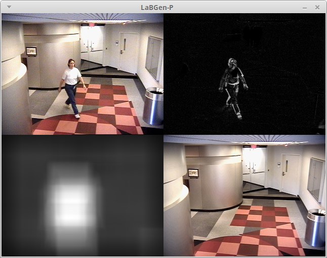

# LaBGen-P

[](http://opencv.org) [](https://travis-ci.org/benlaug/labgen-p)

LaBGen-P is a pixel-level stationary background generation method introduced in [[1](#references)], and based on [LaBGen](https://github.com/benlaug/labgen). Our method has been ranked second during the [IEEE Scene Background Modeling Contest (SBMC) 2016](http://pione.dinf.usherbrooke.ca/sbmc2016). The current ranking and the quantitative metrics computed on the [SBMnet dataset](http://www.scenebackgroundmodeling.net) are available [here](http://pione.dinf.usherbrooke.ca/results).


The purpose of this repository is twofold:

1. To share the source code of the method.
2. To embed the method in a ready-to-use program.

Here is a video showing some backgrounds estimated by LaBGen-P (click on the image below to play it):

[](https://www.youtube.com/watch?v=lcXHM42EeZo "Click to play")

## Compiling the program

The program implementing the method has been developed in C++11 and is distributed under the [GPLv3](LICENSE) license. In order to compile it, you need a modern C++ compiler, a copy of the [Boost](http://www.boost.org) library, a copy of the [OpenCV](http://opencv.org) library, and the [CMake](https://cmake.org) build automation tool. On UNIX-like environments, the program can be compiled as follows, considering that your terminal is in the source code directory:

```
$ cd build
$ cmake -DCMAKE_BUILD_TYPE=Release ..
$ make
```

## Running the program

Once the program has been compiled, the following command gives the complete list of available options:

```
$ ./LaBGen-P-cli --help
```

As an example, the IBMtest2 sequence of the [SBI dataset](http://sbmi2015.na.icar.cnr.it/SBIdataset.html) [[4](#references)] can be processed with the default set of parameters as follows:

```
$ ./LaBGen-P-cli -i path_to_IBMtest2/IBMtest2_%6d.png -o my_output_path -d -v
```



A full documentation of the options of the program is [available on the wiki](https://github.com/benlaug/labgen-p/wiki/Arguments-of-the-program).

## Citation

If you use LaBGen-P in your work, please cite paper [[1](#references)] as below:

```
@inproceedings{Laugraud2016LaBGen-P,
  title = {{LaBGen-P}: A Pixel-Level Stationary Background Generation Method Based on {LaBGen}},
  author = {B. Laugraud and S. Pi{\'e}rard and M. {Van Droogenbroeck}},
  booktitle = {IEEE International Conference on Pattern Recognition (ICPR), IEEE Scene Background Modeling Contest (SBMC)},
  pages = {107-113},
  year = {2016},
  month = {December},
  address = {Canc{\'u}n, Mexico},
  doi = {10.1109/ICPR.2016.7899617}
}
```

## Alternatives

* The original patch-based version of [LaBGen](https://github.com/benlaug/labgen).
* A variant of LaBGen, called [LaBGen-OF](https://github.com/benlaug/labgen-of), and leverages optical flow algorithms for motion detection.

## Testing

Each commited revision is automatically tested using [Travis CI](https://travis-ci.org/benlaug/labgen-p) on:

* Ubuntu 14.04 with the `g++` compiler and OpenCV 2.3 installed from the Ubuntu repositories.
* Ubuntu 14.04 with the `g++` compiler and OpenCV 3.2 compiled from the sources.
* OS X El Capitan with the `clang++` compiler and OpenCV 2.4 installed with [Homebrew](https://brew.sh).
* OS X El Capitan with the `clang++` compiler and OpenCV 3.2 installed with [Homebrew](https://brew.sh).

## References

[1] [B. Laugraud, S. Piérard, M. Van Droogenbroeck. LaBGen-P: A Pixel-Level Stationary Background Generation Method Based on LaBGen. *International Conference on Pattern Recognition (ICPR), IEEE Scene Background Modeling Contest (SBMC)*, 107–113, 2016.](http://hdl.handle.net/2268/201146)

[2] L. Maddalena, A. Petrosino. Towards Benchmarking Scene Background Initialization. *International Conference on Image Analysis and Processing Workshops (ICIAP Workshops)*, 9281:469-476, 2015.
